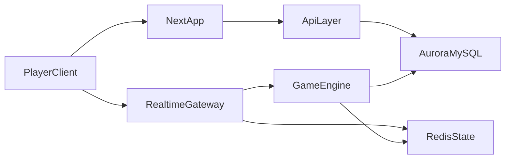

# American Mahjong MVP Plan

## Goal
Ship a first playable web MVP focused on `American Mahjong` private rooms for family/friend play: create room, share link, join as guest, play a synchronized 4-player game with large readable tiles and a simple table UI.

## Product Scope
In scope for V0:
- Guest-only private rooms with shareable join links
- Host creates room, 4 seats, ready/start/reset flow
- Accessibility-first UI: large tile rendering, high-contrast controls, persistent `S/M/L` font-size setting
- Server-authoritative realtime game loop for one fixed American Mahjong card snapshot
- Core gameplay only: deal, draw, discard, claims/calls as supported by the selected simplified rules profile, Mahjong declaration, server-side win validation
- End-of-hand result summary without full automated scoring
美式麻将核心缺失：Joker百搭牌全套逻辑（NMJL必备，现有scope完全没提joker处理、joker替换校验、手牌joker数量限制），这是美式麻将灵魂，V0简化规则也不能丢。
Out of scope for V0:
- Charleston
- Automated scoring/payouts
- Matchmaking, friends, rankings, chat, cosmetics, payments
- Multi-card-year support and custom house-rule editor
- Native apps

## Recommended Architecture
Planned greenfield structure:
- Frontend: Next.js app on Vercel for the accessible room flow and game table
- Realtime/game service: Node.js/TypeScript authoritative game server using WebSockets
- Persistent storage: Aurora MySQL for rooms, players, game metadata, and saved results
- Ephemeral state: ElastiCache Redis for live room presence, seat state, turn state, and pub/sub fanout

## Initial Repo Blueprint
Because the repo is currently empty, start with a monorepo layout like:
- [`/apps/web`](/apps/web): Next.js UI for landing, create room, join room, and table view
- [`/apps/realtime`](/apps/realtime): WebSocket session server and game orchestration
- [`/packages/game-engine`](/packages/game-engine): turn flow, legal actions, visibility rules
- [`/packages/american-card`](/packages/american-card): fixed card snapshot and hand-validation rules
- [`/packages/ui`](/packages/ui): tile, seat, action bar, modal, typography primitives
- [`/packages/db`](/packages/db): schema, migrations, DB access for Aurora
- [`/infra`](/infra): deployment/env docs and AWS service wiring notes

## Core Domain Design
Keep these concerns separate from day one:
- Room domain: room creation, join-by-link, seat assignment, ready/start/reset, reconnect identity
- Game session domain: wall, hands, discards, public melds, turn order, legal actions, hand end
- Rules/validation domain: the chosen American card snapshot, hand templates, Mahjong validation
- Transport domain: WebSocket events and reconnect/resync snapshots

Important state split:
- `Aurora`: users/guest identities, room records, finished hand summaries, audit/event records
- `Redis`: active rooms, seating, timers, current turn, visible board state, resumable snapshots

## Delivery Slices
### Slice 1: App foundation
- Scaffold monorepo, shared TypeScript config, linting, env handling, and deployment targets
- Create accessible design tokens for large tiles, large tap targets, and `S/M/L` text scaling
- Define DB schema for rooms, players, and finished hands

### Slice 2: Room flow
- Landing page with `Create room` and `Join room`
- Guest name entry only, no password/account requirement
- Link-based room join with room code fallback
- Host controls for seating and starting a game

### Slice 3: Realtime table shell
- WebSocket connection lifecycle, reconnect token, room presence, heartbeat
- Server snapshot + client resync model
- Table layout with four seats, concealed hand zone, discards, action log, and turn indicator

### Slice 4: Simplified American Mahjong engine
- Fixed deck/wall setup and dealing
- Draw/discard flow with server-side action validation
- Public meld representation and claim resolution for the supported rules subset
- Mahjong declare action and win validation against one fixed card snapshot

### Slice 5: Hand-end and persistence
- Winner confirmation or invalid declaration handling
- Save room/game summary to Aurora
- Reset/start next hand from room UI

## Key Technical Decisions
- Use server-authoritative rules processing; clients only send intents like `joinRoom`, `takeSeat`, `discardTile`, `declareMahjong`
- Model the American card as structured data in [`/packages/american-card`](/packages/american-card), not embedded in UI or socket handlers
- Persist only durable records to Aurora; keep active-table truth in Redis for low-latency fanout and recovery
- Store guest preferences like font size in a lightweight identity/session record so `S/M/L` survives rejoin on the same guest profile

## Major Risks And Mitigations
- American hand validation is the hardest logic: isolate it as pure functions with focused tests before wiring UI
- Accessibility can regress if game UI is optimized for density: lock minimum tile sizes and large touch targets early in the shared UI package
- Reconnect bugs can ruin family play sessions: treat server snapshot/resync as a first-class feature, not polish
- Scope creep from full American rules: keep V0 to one card snapshot and explicitly defer Charleston/scoring

## First Build Order
1. Scaffold repo and shared packages
2. Implement room create/join flow and guest identity
3. Stand up WebSocket room presence and seat sync
4. Render accessible table UI from mocked server snapshots
5. Implement core engine and validation for one fixed card snapshot
6. Persist finished hands and add reset/start-next-hand flow

## Concrete First Files To Create
- [`/apps/web/package.json`](/apps/web/package.json)
- [`/apps/web/app/page.tsx`](/apps/web/app/page.tsx)
- [`/apps/web/app/room/[roomId]/page.tsx`](/apps/web/app/room/[roomId]/page.tsx)
- [`/apps/realtime/src/server.ts`](/apps/realtime/src/server.ts)
- [`/packages/game-engine/src/session.ts`](/packages/game-engine/src/session.ts)
- [`/packages/game-engine/src/events.ts`](/packages/game-engine/src/events.ts)
- [`/packages/american-card/src/card-2026.ts`](/packages/american-card/src/card-2026.ts)
- [`/packages/american-card/src/validate-hand.ts`](/packages/american-card/src/validate-hand.ts)
- [`/packages/db/schema.sql`](/packages/db/schema.sql)
- [`/infra/architecture.md`](/infra/architecture.md)
